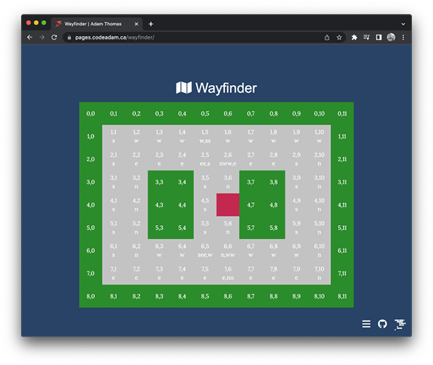

# A Basic Webpage Tinkering with Wayfinding Algorithms

A basic wayfinding example using JavaScript.

> The Wayfinder tool is available to view at:  
> https://pages.codeadam.ca/wayfinder

***

## Repo Resources

* [Sample Wayfinder](https://pages.codeadam.ca/wayfinder)

